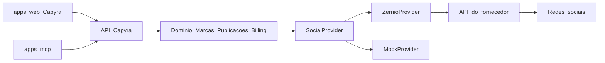
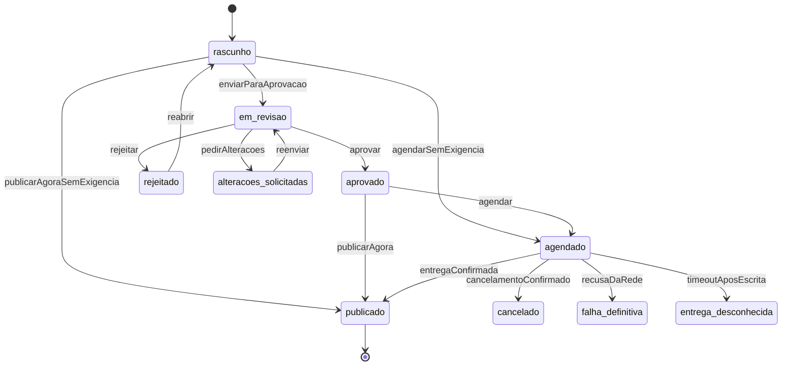

# PRD — Capyra Social

**Produto:** Capyra Social
**Status:** rascunho para o primeiro lançamento
**Data:** 20/09/2026
**Audiência:** produto, engenharia e operação comercial
**Idioma da interface:** `pt-BR` (padrão), `en` e `es` no site, webapp, e-mails e MCP
**Glossário canônico:** [`CONTEXT.md`](../CONTEXT.md)
**ADRs:** [`docs/adr/`](adr/README.md)
**Stack:** [`stack.md`](stack.md)
**Identidade visual:** [`docs/design/`](design/README.md)

---

## 1. Visão e problema

Agências de marketing e influenciadores digitais gerenciam várias marcas, várias redes e vários aprovadores ao mesmo tempo. O trabalho hoje se espalha entre calendários, planilhas, WhatsApp, e-mail e um conjunto de ferramentas que não conversam entre si. Cada rede tem o próprio fluxo de conexão, o próprio limite de mídia e o próprio relatório. O cliente da agência não vê o conteúdo até ele já estar publicado — ou vê demais, inclusive a marca de um fornecedor terceiro.

O Capyra Social é a plataforma em que essas equipes **gerenciam todas as mídias sociais das marcas em um só lugar**. O operador agenda posts, gera relatórios, pesquisa anúncios de concorrentes e conduz o fluxo de criação e aprovação de conteúdo sem sair do Capyra.

Por baixo, a publicação nas redes usa um fornecedor white label. O usuário e o cliente da agência identificam **somente Capyra** e a rede social oficial (Instagram, TikTok, LinkedIn). Qualquer menção, logo, domínio ou e-mail do fornecedor é defeito, não detalhe de implementação.

### 1.1 Resultado pretendido

Uma equipe de agência ou um criador consegue, no mesmo produto:

1. conectar as contas das marcas;
2. criar e adaptar conteúdo por rede;
3. obter aprovação antes de publicar;
4. agendar ou publicar imediatamente;
5. medir o desempenho em relatórios com a marca Capyra;
6. pesquisar anúncios de concorrentes nas bibliotecas públicas da Meta e do LinkedIn;
7. pagar apenas pelas contas de rede efetivamente conectadas.

### 1.2 Público-alvo

| Segmento | Necessidade central |
| --- | --- |
| Agências de marketing | Várias **Marcas**, equipe interna, aprovação por **Aprovador**, relatório white-label, **Marcas atribuídas** por Operador |
| Influenciadores digitais | Uma ou poucas **Marcas** próprias, calendário único, relatórios para marcas/parceiros, operação enxuta |

O **Tipo de conta** (`agency` ou `creator`) segmenta a experiência, não o plano nem o preço. A unidade comercial é a **Conta social** conectada.

---

## 2. Objetivos e métricas

### 2.1 Objetivos do primeiro lançamento

- Entregar o ciclo completo **criar → aprovar → publicar → medir → pesquisar concorrentes** nas três redes da v1: **Instagram**, **TikTok** e **LinkedIn**.
- Manter a **Jornada social white label** em conexão, consentimento, callback, reconexão, revogação, erros, e-mails e publicação.
- Cobrar de forma previsível: **R$ 49,90 por mês por Conta social conectada**.
- Recortar conteúdo, aprovações e métricas às **Marcas atribuídas**, sem tratar **Marca** como tenant; o isolamento é a **Conta Capyra**.
- Permitir trocar o fornecedor social no futuro sem reescrever a API pública nem a interface.

### 2.2 Indicadores de sucesso

| Indicador | Definição | Direção |
| --- | --- | --- |
| Contas sociais pagas | Contas sociais ativas no ciclo de cobrança | Crescer com retenção |
| Posts publicados no prazo | Destinos cuja publicação confirmada ocorreu no horário agendado (± tolerância da rede) | ≥ 95% dos Destinos não cancelados |
| Tempo de aprovação | Mediana entre envio para revisão e decisão (aprovar / rejeitar / pedir alterações) | Reduzir após onboarding |
| Falhas de entrega | Destinos em falha definitiva / Destinos submetidos | Monitorar e reduzir |
| Retenção de Conta Capyra | Contas com pelo menos uma Conta social paga no ciclo seguinte | Crescer |
| CSAT / NPS pós-publicação e pós-relatório | Pesquisa in-product pontual | Qualitativo + tendência |
| Incidente white label | Superfície em que o operador identificou o fornecedor | Zero em produção |

### 2.3 Economia (interna)

O Capyra cobra R$ 49,90 / Conta social / mês. O fornecedor atual fatura por conta conectada (primeiras duas contas gratuitas no plano de uso; depois cerca de US$ 6, US$ 3 e US$ 1 conforme o volume). A margem unitária precisa permanecer positiva depois de câmbio, impostos, mídia, e-mail e suporte. Esse número **não aparece** para o cliente.

---

## 3. Personas e papéis

Toda pessoa autenticada que participa de uma **Conta Capyra** é um **Operador**, com um papel.

| Papel | Quem é | Pode | Não pode |
| --- | --- | --- | --- |
| **Proprietário** | Dono da agência, sócio ou o próprio influenciador | Cobrança, Operadores, conexões sociais, todas as Marcas, publicar, aprovar, relatórios | — |
| **Criador** | Social media, redator, designer | Criar rascunhos, editar conteúdo das Marcas autorizadas, enviar para aprovação, consultar calendário e relatórios | Conectar redes, gerir cobrança, convidar/remover membros, publicar se a Marca exigir aprovação e ainda não estiver aprovado |
| **Aprovador** | Coordenação da agência ou cliente da marca | Ver conteúdo das Marcas atribuídas, comentar, aprovar, rejeitar, pedir alterações | Conectar redes, alterar cobrança, editar o conteúdo após envio (exceto devolver com comentário) |
| **Visualizador** | Cliente, parceiro ou analista | Somente leitura: calendário, publicações, relatórios das Marcas atribuídas | Qualquer mutação |

Regras:

- Cada **Conta Capyra** tem exatamente um **Proprietário**.
- O **Proprietário** não transfere o Papel na v1.
- Um **Operador** tem exatamente um **Papel**; o papel não muda por Marca.
- **Criador**, **Aprovador** e **Visualizador** são limitados ao conjunto de **Marcas** atribuídas; o **Proprietário** vê todas.
- Somente o **Proprietário** conecta redes, convida ou remove Operadores e altera cobrança.
- O cliente da agência entra como **Aprovador** ou **Visualizador** das **Marcas atribuídas** — nunca vê as outras Marcas. Esse e-mail não pode ter outra Conta Capyra.
- No tipo `creator`, o fluxo mínimo é um **Proprietário**; a **Política de aprovação** continua sendo por Marca (padrão desligado).
- O **Proprietário** pode alterar o **Tipo de conta**. Isso não muda preço, Papel, Marcas nem a Política de aprovação já gravada.

### Idiomas

A plataforma atende **`pt-BR`** (padrão), **`en`** e **`es`** no site, no webapp, nos e-mails Capyra e nas descrições do MCP.

- Visitante do site: prefixo de rota (`/pt-br`, `/en`, `/es`); `pt-BR` se o path omitir.
- **Operador**: após o login, vale o **Idioma** gravado no perfil (padrão `pt-BR`); o seletor no webapp altera só a interface, não o **Fuso da marca**.
- API: `code` estável em inglês; texto humano segue `Accept-Language` ou o Idioma do Operador. Códigos de erro não se traduzem.
- Conteúdo publicado nas redes (texto do Destino) **não** é traduzido pelo Capyra.
- White label: as três línguas dizem Capyra, nunca o **Fornecedor social**.

---

## 4. Glossário

O glossário canônico está em [`CONTEXT.md`](../CONTEXT.md). Este PRD não redefine termos.

Relacionamentos que o produto assume (detalhe e diálogo em CONTEXT):

- Uma **Marca** pertence a uma única **Conta Capyra** e não é tenant.
- Uma **Marca** tem no máximo uma **Conta social** ativa por rede.
- Uma **Identidade nativa** verificada tem no máximo uma **Conexão social** ativa em todo o Capyra.
- Uma **Publicação** pertence a uma **Marca** e possui um ou mais **Destinos**.
- Identificadores do **Fornecedor social** nunca são IDs públicos nem critério de Conta.

---

## 5. Redes da v1 e expansão

### 5.1 Incluídas no primeiro lançamento

Três redes. Capacidades abaixo são **baseline de planejamento**. O produto consulta o `SocialProvider` antes de cada submissão e recusa o que a rede ou o fornecedor não aceitar no momento. O Capyra não envia mídia inválida esperando que o fornecedor “corrija”.

| Rede | Escopo da v1 | Notas essenciais |
| --- | --- | --- |
| Instagram | Feed, Reels, Stories, carrossel | Conta profissional; formatos, quantidade de itens e capa validados antes de agendar |
| TikTok | Vídeo e carrossel de fotos | Mídia obrigatória; prévia e consentimento explícitos; contas Business publicam vídeo direto como público |
| LinkedIn | Página da organização **ou** perfil pessoal, conforme a autorização | Um slot por Marca; a seleção é no Capyra. Página e perfil ao mesmo tempo exigem **Marcas** distintas (ou fica fora da v1). Analytics de perfil pessoal só para posts publicados pelo Capyra |

Facebook, YouTube, Twitter/X, Pinterest e Google Meu Negócio **não** entram neste lançamento.

### 5.2 Fora da v1 (conectores futuros)

O fornecedor já cobre outras redes. O Capyra **não as oferece** no primeiro lançamento, mas a camada `SocialProvider` deve aceitar novos códigos de plataforma sem quebrar contratos existentes.

| Rede | Quando entrar | Notas já conhecidas |
| --- | --- | --- |
| Facebook | Depois da v1 | Posts de Página; seleção de Página no Capyra; perfil pessoal não é destino |
| YouTube | Depois da v1 | Vídeo e Shorts; um vídeo por Destino; sem post de comunidade no primeiro corte da rede |
| Twitter/X | Depois da v1 | Texto, imagem, vídeo, thread se o provider suportar; custo extra de API possível no fornecedor, sem taxa avulsa ao cliente |
| Pinterest | Depois da v1 | Pin; seleção de board no Capyra |
| Google Meu Negócio | Depois da v1 | Post da ficha; seleção de local no Capyra; uma ficha = uma Conta social |
| Threads, WhatsApp, Reddit, Bluesky, Telegram, Snapchat, Discord | Depois da v1 | Códigos de plataforma, sem produto à parte |

Incluir uma rede nova é: ligar o conector no provider, declarar capacidades, passar pelo **Gate white label** daquela rede, e expô-la na UI/billing. Não é um segundo produto.

### 5.3 Capacidades dinâmicas

Antes de salvar rascunho avançado, agendar ou publicar, o Capyra obtém do provider:

- formatos aceitos;
- limites de caracteres, duração, peso e quantidade de mídia;
- necessidade de seleção (organização ou perfil no LinkedIn; Página, board, local ou canal quando a rede futura exigir);
- se a identidade está verificada e apta a publicar;
- restrições de privacidade (ex.: TikTok público).

O compositor mostra só o que a rede aceita naquele Destino.

---

## 6. Jornadas

### 6.1 Entrar sem senha

1. A pessoa informa o e-mail.
2. O Capyra envia **link mágico** e, no mesmo e-mail, um **código de acesso** numérico de uso único.
3. Abrir o link **ou** digitar o código autentica. Os dois invalidam um ao outro depois do primeiro uso bem-sucedido.
4. E-mail desconhecido cria a **Conta Capyra** no primeiro acesso bem-sucedido (tipo escolhido: agência ou criador) e uma **Marca** inicial.
5. Sessão Capyra em cookie httpOnly; não há senha local.

O mesmo mecanismo autentica convites de equipe: o convite está amarrado ao e-mail; aceitar com outro e-mail falha.

### 6.2 Organizar Marcas e equipe

1. O Proprietário nomeia a Marca e confirma o **Fuso da marca** (padrão `America/Sao_Paulo`).
2. Convida Criadores, Aprovadores e Visualizadores por e-mail, com Marcas atribuídas.
3. O convidado entra com link mágico ou código; passa a operar só o que lhe foi concedido.
4. Remover um Operador revoga o acesso na hora, inclusive em sessão ainda aberta nas rotas autenticadas seguintes.

### 6.3 Conectar uma rede

1. Só o Proprietário inicia ou encerra **Conexão social**.
2. Ao criar a Marca, o Capyra cria de forma idempotente o perfil correspondente no fornecedor (invisível).
3. O Proprietário escolhe a rede. O Capyra inicia OAuth **headless**: o navegador vai da UI Capyra para a tela oficial da rede e volta ao **domínio Capyra**.
4. Se a rede exigir escolha (organização ou perfil no LinkedIn; Página, board, local ou canal nas redes futuras), essa tela é do Capyra, nunca do fornecedor.
5. A identidade nativa verificada ocupa o slot daquela rede na Marca. Outra identidade no mesmo slot é bloqueada até desconexão explícita.
6. A nova Conta social entra na cobrança (pró-rata do ciclo corrente).
7. O Capyra importa metadados e métricas dos **noventa dias** anteriores como **Posts externos** (sem baixar binários automaticamente).

### 6.4 Criar conteúdo

1. O Criador (ou o Proprietário) abre o compositor no contexto de uma Marca.
2. Escolhe uma ou mais Contas sociais conectadas. Cada uma vira um **Destino**.
3. Texto, hashtags, mídia, capa, horário e ajustes específicos podem divergir por Destino.
4. A biblioteca da Marca guarda **Mídia original**; se a rede exigir outro recorte ou duração, o operador envia uma **Variante de mídia**. Não há transcodificação automática pelo Capyra na v1.
5. Validação por Destino ocorre antes de enviar para aprovação ou de agendar.

### 6.5 Aprovar

1. Se a Marca **exige aprovação**, Destino só pode ser agendado ou publicado no estado **aprovado**.
2. O Criador envia a Publicação para revisão. Aprovadores da Marca são notificados **no Capyra** (e por e-mail Capyra, sem citar fornecedor).
3. O Aprovador comenta no item, aprova, rejeita ou pede alterações. Pedido de alteração devolve ao Criador sem publicar.
4. Aprovação é por Destino (um canal aprovado, outro não).
5. Aprovar um Destino que já tem horário o **agenda**. Sem horário, o Destino permanece aprovado até o Criador ou o Proprietário agendar ou publicar. O Aprovador não escolhe horário nem clica em publicar agora.
6. Se a Marca **não exige aprovação**, o Proprietário e o Criador publicam ou agendam direto.

### 6.6 Agendar e publicar

1. Horário é interpretado no **Fuso da marca**, gravado também em UTC. DST inexistente ou ambíguo é recusado. Mudar o fuso depois **não** desloca agendamentos já gravados.
2. Agendar ou publicar cria **Versão de destino** imutável.
3. Calendário da Marca (e da Conta, filtrável) mostra rascunhos, pendentes, aprovados, agendados, publicados e falhos, por rede.
4. Cancelar um Destino futuro só conclui depois da confirmação de que a rede não publicará aquela versão.
5. Editar um Destino **aprovado** ou **agendado** (texto, mídia, horário ou canal) reabre a revisão se a Marca exigir aprovação. Agendar um Destino aprovado sem alterar conteúdo não reabre. Editar um item já agendado cancela a versão vigente (com confirmação) e cria outra.
6. Retry é só para Destinos em **falha definitiva**, por ação explícita, e nunca reenvia Destinos já concluídos.

### 6.7 Relatórios

1. Qualquer papel com leitura na Marca abre relatórios por período, Marca, rede e Destino.
2. Métricas nativas: impressões, alcance, engajamento, cliques, visualizações, salvamentos, seguidores, melhor horário quando a rede fornecer.
3. Indisponível **não** vira zero. Agregação entre redes só ocorre para definições equivalentes.
4. Exportação PDF usa a capivara-logo ([`docs/design/`](design/README.md)) e a palavra “Capyra” no tipo padrão. CSV é só dados. Sem paleta extra, sem wordmark ilustrado, sem nome do fornecedor.

### 6.8 Concorrentes (biblioteca de anúncios)

1. Na Marca, o operador pesquisa anúncios públicos da Meta (requer Instagram conectado) ou do LinkedIn (requer LinkedIn conectado).
2. Filtros: termo, página/anunciante, país, período, status, plataforma de anúncio.
3. Resultados aparecem como pesquisa Capyra. Tokens e nomes do fornecedor não vazam.
4. Isso **não** cria campanhas pagas no Capyra e **não** rastreia o feed orgânico do concorrente.

### 6.9 Cobrança ao conectar e desconectar

1. Conectar uma Conta social adiciona R$ 49,90 / mês, com pró-rata do restante do ciclo.
2. Desconectar não estorna o ciclo corrente; a identidade conta como **Identidade social do ciclo** até o fechamento.
3. Reconectar a **mesma** identidade nativa no mesmo ciclo não gera segunda cobrança.
4. Arquivar a Marca cancela Destinos futuros, desconecta contas e encerra cobrança dessas contas no ciclo seguinte.

---

## 7. Requisitos funcionais

IDs estáveis para rastreio em specs e testes.

### 7.1 Conta e equipe

- **FR-001.** Toda Conta Capyra possui Tipo `agency` ou `creator`, exatamente um Proprietário e zero ou mais Operadores nos demais papéis.
- **FR-002.** Toda Conta nova nasce com uma Marca inicial de nome placeholder (`Minha marca` no padrão `pt-BR`). O Fuso da marca padrão é `America/Sao_Paulo`. Nome não vazio e fuso são confirmados antes de qualquer agendamento; o navegador não é fonte da verdade.
- **FR-003.** Convites são de uso único, vinculados ao e-mail, com expiração (sete dias) e papéis/Marcas explícitos. A lista de Marcas atribuídas pode ser vazia; o Operador entra e não opera Marca nenhuma até o Proprietário atribuir.
- **FR-004.** Um e-mail autenticado participa de no máximo uma Conta Capyra na v1.
- **FR-005.** Remoção de Operador revoga autorização imediatamente nas APIs, em todos os lugares autenticados; logout encerra só aquele acesso. Sessões antigas falham no próximo request autenticado.
- **FR-006.** Criador, Aprovador e Visualizador só enxergam Marcas atribuídas; Proprietário enxerga todas.
- **FR-006b.** O Proprietário altera Papel e Marcas atribuídas de Criador, Aprovador e Visualizador na hora, sem novo Convite. Não promove a Proprietário.

### 7.2 Autenticação

- **FR-007.** Login e primeiro acesso usam somente e-mail + link mágico ou código de acesso; não há senha.
- **FR-008.** Link e código expiram, são de uso único e pertencem a um único e-mail.
- **FR-009.** E-mails transacionais de autenticação, convite e cobrança identificam só Capyra e saem no **Idioma** do destinatário (`pt-BR`, `en` ou `es`). Convite a quem ainda não entrou sai no Idioma do Proprietário; no primeiro acesso o convidado grava o próprio Idioma. Visual: capivara-logo + a palavra “Capyra”; sem mascote no corpo; sem o **Fornecedor social**.

### 7.3 Marcas

- **FR-010.** Mutações autenticadas filtram `accountId` e validam `brandId`; não existe operação “sem Marca”.
- **FR-011.** Só o Proprietário arquiva uma Marca. Arquivar confirma cancelamento dos Destinos futuros, desconecta Contas sociais e deixa histórico somente leitura.
- **FR-012.** Mídia original de Marca arquivada ou com exclusão solicitada expira em trinta dias, salvo vínculo com Publicação ainda não concluída.
- **FR-013.** Restaurar Marca exige novas conexões; o histórico antigo não é reatribuído a outra identidade.

### 7.4 Conexões sociais

- **FR-014.** Só o Proprietário conecta, reconecta ou desconecta.
- **FR-015.** No máximo uma Conta social ativa por rede e Marca; no máximo uma conexão ativa global por identidade nativa verificada.
- **FR-016.** A autorização social é de uso único, expira e vincula Operador, Conta, Marca e rede. O navegador não decide a propriedade da identidade.
- **FR-017.** Identidade não verificável fica pendente e não publica. Reconexão insegura (troca de identidade disfarçada de refresh) é bloqueada antes da autorização; handle não é a chave de identidade.
- **FR-018.** Desconexão só termina após cancelamento confirmado dos Destinos futuros daquela Conta social.
- **FR-019.** Perda de autorização marca **Conexão com ação necessária**, bloqueia novos envios e alerta o Proprietário.
- **FR-020.** OAuth é headless: callback no domínio Capyra; seleção de organização/perfil LinkedIn (e Página/board/local/canal quando a rede existir) na UI Capyra.

### 7.5 Mídia

- **FR-021.** Biblioteca privada por Conta e Marca; binários fora do banco de estado; metadados e referências no Capyra.
- **FR-022.** Uploads até 200 MB (imagens, vídeo); o Capyra não transcodifica, não reenquadra e não comprime na v1. Só Proprietário e Criador enviam Mídia original e Variante de mídia nas Marcas atribuídas; Aprovador e Visualizador não enviam arquivo.
- **FR-023.** Destino usa Mídia original compatível ou Variante de mídia fornecida pelo operador.
- **FR-024.** Mídia em uso por Destino não concluído não pode ser eliminada.

### 7.6 Publicação e agendamento

- **FR-025.** Publicação agrupa Destinos; cada Destino tem conteúdo, mídia, horário e estado próprios.
- **FR-026.** Agendar ou publicar cria Versão de destino imutável e chave de idempotência.
- **FR-027.** Horário segue o Fuso da marca; instantes existentes não se deslocam se o fuso mudar.
- **FR-028.** Cancelamento incerto e escrita com resultado desconhecido permanecem estados explícitos (**Entrega desconhecida**); não há reenvio automático.
- **FR-029.** Retry seletivo não repete Destinos concluídos.
- **FR-030.** Agendamentos além da janela de mídia temporária do fornecedor (cerca de sete dias; o Capyra usa seis) ficam duráveis no Capyra e só são enviados ao fornecedor ao entrar na janela.
- **FR-031.** Calendário lista Destinos da Marca (e da Conta, com filtro) por dia, rede e estado.
- **FR-032.** Importação inicial cobre noventa dias de Posts externos disponíveis, com paginação e deduplicação, sem download automático de arquivo.
- **FR-033.** Edição ou remoção de post **já publicado na rede** está fora da v1.

### 7.7 Aprovação

- **FR-034.** Cada Marca configura se publicação/agendamento exige aprovação.
- **FR-035.** Estados do Destino no fluxo editorial: `rascunho`, `em_revisao`, `aprovado`, `rejeitado`, `alteracoes_solicitadas`, `agendado`, `publicado`, `cancelado`, `falha_definitiva`, `entrega_desconhecida`.
- **FR-036.** Comentário pertence ao Destino, com autor, horário e visibilidade restrita à Conta e às Marcas atribuídas. Proprietário, Criador e Aprovador escrevem; Visualizador só lê. O e-mail não é o fio.
- **FR-037.** Aprovação é por Destino; um Destino aprovado não libera os demais.
- **FR-038.** Pedido de alteração reabre o rascunho para o Criador e impede agendar/publicar até nova aprovação, se a exigência estiver ligada.
- **FR-039.** Visualizador não aprova; Aprovador não publica; Criador não aprova. O Proprietário cria, aprova, publica e lê em todas as Marcas — inclusive o Destino que ele mesmo escreveu.

### 7.8 Relatórios

- **FR-040.** Snapshots de métricas nativas por Conta social e por Destino, com origem, período, instante da observação e instante da atualização.
- **FR-041.** Métrica ausente permanece ausente; a UI explica a indisponibilidade.
- **FR-042.** Relatórios filtráveis por Marca, rede, período e Destino; comparações não afirmam causalidade.
- **FR-043.** Exportação PDF com a capivara-logo e a palavra “Capyra” no tipo padrão; CSV só dados. Sem paleta extra, sem nome, logo ou rodapé do fornecedor.
- **FR-044.** Melhor horário, histórico de seguidores e demografias entram quando o provider os fornecer para aquela rede; ausência não inventa número.

### 7.9 Concorrentes

- **FR-045.** Pesquisa na biblioteca de anúncios da Meta exige Conta social ativa de Instagram na Marca.
- **FR-046.** Pesquisa na biblioteca de anúncios do LinkedIn exige Conta social ativa de LinkedIn na Marca.
- **FR-047.** A API pública do Capyra expõe busca, filtros e resultados em modelo próprio; IDs internos do fornecedor não vazam.
- **FR-048.** A feature não cria, edita nem veicula anúncios.

### 7.10 Cobrança

- **FR-049.** Preço de lista: **R$ 49,90 por Conta social conectada, por mês**, em BRL, recorrente e self-service.
- **FR-050.** A fatura do ciclo soma as Identidades sociais do ciclo; reconectar a mesma identidade não duplica.
- **FR-051.** Nova conexão no meio do ciclo entra em pró-rata; desconexão não estorna o ciclo corrente.
- **FR-052.** Sem Conta social ativa, a Conta Capyra permanece gratuita para login, Marcas e rascunhos locais, mas não publica.
- **FR-053.** Falha de pagamento marca a Conta em **Inadimplência**: bloqueia novas conexões e qualquer ação que agende ou publique, inclusive aprovar um Destino com horário. Rascunho, comentário, rejeitar e leitura permanecem. Destinos já enviados ao fornecedor seguem a política de cancelamento confirmado.
- **FR-054.** Somente o Proprietário vê e altera método de pagamento, faturas e portal de cobrança.

### 7.11 Auditoria e notificações

- **FR-055.** Ações sensíveis registram ator, Conta, Marca, recurso, horário e correlação — sem credenciais, mídia bruta, tokens ou URL assinada.
- **FR-056.** Notificações in-app e e-mail Capyra para: convite, código/link de acesso, aprovação pendente, decisão de aprovação, conexão com ação necessária, falha definitiva de Destino, fatura e recibo.

### 7.12 White label

- **FR-057.** Em conexão, consentimento, seleção, callback, reconexão, revogação, erros, e-mails, suporte, lista de aplicativos autorizados e publicação, o Operador só pode identificar Capyra e a rede social.
- **FR-058.** Contratos públicos, logs visíveis ao cliente, PDFs, webhooks de saída (se houver) e textos de erro usam vocabulário Capyra.
- **FR-059.** IDs, nomes de perfil e URLs do fornecedor não são aceitos como identificadores públicos.

### 7.13 Idiomas

- **FR-060.** Site, webapp, e-mails Capyra e MCP oferecem `pt-BR`, `en` e `es`; o padrão é `pt-BR`.
- **FR-061.** O **Operador** persiste um **Idioma**; mudá-lo não altera o **Fuso da marca** nem traduz Destinos já escritos.

### 7.14 MCP

- **FR-062.** O MCP headless autentica um **Operador** e chama só `/api/v1`; respeita **Papel** e Marcas atribuídas; não acessa SQL, blob, Stripe, Resend nem o **Fornecedor social**. Não há Papel extra nem atalho de Proprietário.

---

## 8. Arquitetura — camada Social Provider

Runtime, frameworks e adapters de nuvem estão em [`stack.md`](stack.md). Esta seção cobre só o fornecedor social.

A UI e a API pública conhecem só o domínio Capyra. O fornecedor atual (Zernio) é uma implementação interna, substituível.

### 8.1 Fronteiras

- A API Capyra é a única fronteira de negócio e de integração externa.
- O web app e o MCP falam apenas com a API Capyra.
- `SocialProvider` encapsula conexão OAuth, perfis, contas, upload de mídia, agendamento, publicação, cancelamento, analytics, biblioteca de anúncios e webhooks.
- `ZernioProvider` é a implementação de produção do primeiro lançamento.
- `MockProvider` cobre desenvolvimento e testes; nunca é fallback silencioso em produção.
- Adicionar outro fornecedor (ou um conector nativo) significa nova implementação do mesmo contrato, com roteamento por Conta, Marca ou plataforma — sem mudar recursos públicos.

### 8.2 Regras do adaptador

- Um perfil no fornecedor corresponde a uma **Marca**. Nomes internos do perfil não são exibidos.
- O adaptador mapeia erros do fornecedor para códigos Capyra (`authorization_required`, `identity_unverified`, `delivery_unknown`, `platform_rejected`, etc.).
- Respostas públicas usam IDs Capyra (`accountId`, `brandId`, `socialAccountId`, `publicationId`, `destinationId`).
- Webhooks do fornecedor chegam em endpoint interno dedicado, com verificação HMAC-SHA256 do corpo bruto, deduplicação por ID de evento e resposta `2xx` rápida; o processamento de domínio ocorre depois.
- Tenant e Marca são resolvidos **só** pelo mapeamento interno conhecido, nunca pelo ID solto do fornecedor.
- Eventos fora de ordem não regridem estado terminal (`publicado`, `cancelado`, `falha_definitiva`).
- Connect usa modo headless e `redirect_url` no domínio Capyra.

### 8.3 Agendamento e mídia no fornecedor

Uploads temporários do fornecedor expiram em cerca de sete dias. Por isso:

- Destinos a até seis dias são transferidos imediatamente;
- Destinos mais distantes permanecem no Capyra;
- um job periódico envia à fila social os Destinos que entraram na janela, com chave idempotente;
- reconciliação cobre webhooks perdidos, timeouts após escrita e **Entrega desconhecida**.

### 8.4 Contrato público (orientação)

Recursos sob `/api/v1`, camelCase, IDs próprios, paginação e autorização por Conta/Marca. Famílias previstas:

- `/auth` (solicitar link/código, completar sessão, sair)
- `/brands` (CRUD, arquivar, restaurar, política de aprovação)
- `/members` e `/member-invitations`
- `/brands/{brandId}/social-connections` e sessões de autorização por plataforma
- `/media`
- `/publications` e destinos (rascunho, enviar para revisão, aprovar, rejeitar, agendar, publicar, cancelar, retry)
- `/calendar`
- `/external-posts`
- `/reports` e `/metrics`
- `/competitors/ads`
- `/billing`
- `/notifications` e `/audit-events`

Nenhum desses recursos nomeia o fornecedor.

---

## 9. Autenticação e sessão

| Item | Regra |
| --- | --- |
| Identificador | E-mail |
| Fatores | Link mágico **ou** código numérico (OTP) enviados no mesmo e-mail transacional Capyra, via **Resend** |
| Validade | Curta (minutos para o código; minutos a poucas horas para o link); um uso |
| Conta inexistente | Primeiro login bem-sucedido provisiona Conta Capyra + Marca inicial |
| Sessão | Cookie httpOnly, segura, com rotação; logout explícito |
| Equipe | Convite + o mesmo fluxo de e-mail; e-mail do convite precisa coincidir |
| Não incluso na v1 | Senha, OAuth Google/Apple, SMS, passkey |

Códigos e links não autenticam se o e-mail foi alterado, se já foram usados, ou se um novo pedido invalidou os anteriores (último pedido vence). Rate limit por e-mail e por IP reduz abuso.

---

## 10. Fluxo de criação e aprovação

O portal de aprovação é **nativo do Capyra**. O fornecedor social não participa da revisão editorial.

Política por Marca:

- **Aprovação obrigatória** (padrão em `agency`): sem estado `aprovado`, o Destino não agenda nem publica.
- **Aprovação opcional** (padrão em `creator`): Criador e Proprietário publicam direto; o fluxo de revisão continua disponível.

Comentários são o registro da conversa. O produto não empurra o conteúdo para um fio de e-mail como sistema de verdade: o e-mail só avisa que há uma decisão pendente no Capyra.

---

## 11. Relatórios

Relatórios existem para a agência provar trabalho ao cliente e para o criador acompanhar as próprias redes.

Conteúdo mínimo da v1:

- desempenho por Destino publicado via Capyra;
- Posts externos importados, quando a rede devolver métrica;
- série de seguidores da Conta social;
- totais do período por Marca e por rede (somente métricas aditivas e equivalentes);
- exportação PDF (capa Capyra, período, Marca, redes) e CSV.

Limitações conhecidas a comunicar na UI, sem maquiar:

- LinkedIn perfil pessoal: métricas sobretudo para posts publicados pelo Capyra;
- algumas métricas de Reels/vídeo podem vir nulas (não zero);
- janela histórica inicial de noventa dias na importação.

---

## 12. Análise de concorrentes

Na v1, “analisar concorrentes” significa **pesquisar anúncios públicos**, não escuta social orgânica.

| Biblioteca | Pré-requisito na Marca | Uso |
| --- | --- | --- |
| Meta Ad Library | Instagram conectado | Busca por termo, páginas, país, período, status e plataforma |
| LinkedIn Ad Library | LinkedIn conectado | Busca por termo ou anunciante, país e período |

Resultados: criativo visível, anunciante, período de veiculação e metadados públicos disponíveis. O operador usa isso para referência criativa e de mercado. Não há scoring automático de “ameaça” nem importação desses anúncios para o calendário da Marca.

---

## 13. Cobrança

### 13.1 Unidade e preço

| Item | Valor |
| --- | --- |
| Unidade | 1 **Conta social** conectada (ex.: Instagram da Marca A) |
| Preço | **R$ 49,90 / mês** |
| Moeda | BRL |
| Exemplo | 3 Marcas com Instagram = **R$ 149,70 / mês** |
| Ciclo | Mensal recorrente, self-service |
| Quem paga | Proprietário da Conta Capyra |

Não há preço por assento de Operador na v1. Convidar Aprovadores e Visualizadores (incluindo o cliente da agência) não altera a fatura.

O trilho de pagamento é o **Stripe** (Checkout / Billing, BRL, recorrente). A API ajusta a assinatura quando uma **Identidade social do ciclo** entra ou deixa de renovar. Webhooks do Stripe atualizam o direito de uso. A UI Capyra fala em fatura e Conta social, não em “subscription item” nem no **Fornecedor social**. O Stripe pode aparecer na página hospedada de checkout.

### 13.2 Regras do ciclo

- Entra na fatura toda **Identidade social do ciclo**: identidade nativa conectada ao menos uma vez durante o ciclo.
- Reconectar a mesma identidade no mesmo ciclo **não** cobra de novo.
- Trocar a identidade do slot (desconectar @marcaA e conectar @marcaB na mesma rede) conta **duas** identidades no ciclo em que ambas existiram.
- Pró-rata na **conexão**; sem estorno na **desconexão** até o fechamento do ciclo.
- Arquivamento da Marca desconecta as contas; elas não renovam no ciclo seguinte.

### 13.3 Superfície comercial

O Proprietário vê, em linguagem Capyra:

- lista de Contas sociais cobradas no ciclo (Marca, rede, identificador visível, data de conexão);
- próxima cobrança estimada;
- faturas e recibos;
- forma de pagamento.

Nenhum item descreve custo do fornecedor, “account-day” ou nome de API terceira.

---

## 14. Fora do primeiro lançamento

- Inbox unificado, comentários, DMs, reviews e automações de resposta.
- Criação e gestão de campanhas pagas (ads manager); a v1 só **lê** bibliotecas públicas de anúncios.
- Escuta orgânica de concorrentes (posts, crescimento e engajamento de perfis não conectados).
- Análise de vídeo por IA, score entre redes e atribuição causal de desempenho.
- Transcodificação, corte ou compressão automática de mídia.
- Edição ou exclusão de post já publicado na rede.
- Mais de uma Conta social ativa da mesma rede na mesma Marca.
- Participação do mesmo e-mail em várias Contas Capyra.
- Transferência do Papel de **Proprietário**.
- Senha, login social Google/Apple e SSO corporativo.
- CLI e análise de dados em Python / app de IA — fora deste repositório até um corte futuro.
- Exclusão definitiva self-service de **Marca** ou da **Conta Capyra** (privacidade/LGPD); a v1 arquiva.
- API pública para terceiros além do webapp Capyra e do MCP headless.
- Conectores depois da v1: Facebook, YouTube, Twitter/X, Pinterest, Google Meu Negócio, Threads, WhatsApp, Reddit, Bluesky, Telegram, Snapchat, Discord.
- White-label da UI Capyra para a agência revender com a marca dela (o white label aqui é Capyra na frente do fornecedor, não a agência na frente do Capyra).

---

## 15. Gate white label

Nenhum piloto comercial começa sem prova prática. Documentação do fornecedor **não** aprova o gate.

### 15.1 Superfícies

Em cada uma das três redes da v1 (Instagram, TikTok, LinkedIn), o Operador (e o Aprovador, quando aplicável) só pode identificar Capyra e a rede:

1. conexão inicial;
2. consentimento e seleção de conta/organização quando a rede exigir;
3. callback no domínio Capyra;
4. reconexão da mesma identidade;
5. tentativa de conectar identidade diferente em slot ocupado;
6. cancelamento pelo usuário no meio do OAuth;
7. expiração da autorização;
8. revogação na rede e lista de aplicativos autorizados;
9. desconexão iniciada no Capyra;
10. mensagens de erro e recuperação;
11. publicação imediata e agendada dos formatos suportados;
12. identificação exibida no post, em e-mails e em notificações externas.

O modo headless remove telas intermediárias do fornecedor. **Não** prova qual aplicativo aparece no consentimento da rede. Se o app autorizado mostrar o nome do fornecedor, o gate reprova até existir app Capyra (ou equivalente aceito pelo produto).

### 15.2 Identidade

O gate também reprova se não for possível:

- obter identidade nativa estável por rede;
- impedir substituição destrutiva antes da desconexão explícita;
- reconhecer reconexão após mudança de handle;
- recuperar histórico Capyra sem depender da retenção do fornecedor;
- manter o fornecedor invisível em todas as superfícies da §15.1.

### 15.3 Saída

Relatório com evidências (vídeo ou screenshots), data, rede, identidade, URLs/domínios e resultado. Decisão `go/no-go` por rede. Comercial só com `go` nas redes efetivamente vendidas; rede sem `go` permanece desligada na UI.

Referências internas de implementação (não visíveis ao cliente):

- [White label social media scheduler](https://zernio.com/blog/white-label-social-media-scheduler)
- [API Reference](https://docs.zernio.com/api-reference)
- [Profiles](https://docs.zernio.com/guides/profiles)
- [Get OAuth connect URL](https://docs.zernio.com/connect/get-connect-url)
- [Webhooks](https://docs.zernio.com/webhooks)
- [Media uploads](https://docs.zernio.com/guides/media-uploads)

---

## 16. Riscos e premissas

| Risco | Impacto | Mitigação |
| --- | --- | --- |
| Tela de consentimento da rede mostra o app do fornecedor, não o Capyra | Reprova o Gate white label | Prova prática antes do comercial; negociar app próprio / white-label de OAuth |
| LinkedIn analytics incompleto em perfil pessoal | Relatório “vazio” parece bug | Copy honesta; métrica ausente ≠ zero |
| Janela de sete dias de mídia temporária | Agendamento longo falha se o job atrasar | Persistência no Capyra + envio a seis dias + reconciliação |
| Handle alterado interpretado como conta nova | Perda de histórico no fornecedor | Identidade nativa estável no Capyra; bloquear reconexão insegura |
| Aprovador cliente vê Marca errada | Incidente comercial grave | Autorização por Marca em toda query; testes de isolamento |
| Webhook atrasado ou duplicado | Publicação dupla ou estado mentiroso | Idempotência, ID único de evento, estados terminais irreversíveis |
| Troca futura de fornecedor | Retrabalho se o domínio vazar tipos do Zernio | `SocialProvider` obrigatório; contrato público só com IDs Capyra |
| Um e-mail, uma Conta Capyra | Freelancer que atende duas agências não entra nas duas | Fora da v1; documentado; convite recusa e-mail já vinculado |

Premissas:

- O fornecedor permanece parceiro oficial das redes da v1 (Instagram via Meta, TikTok, LinkedIn) o bastante para publicar via API oficial.
- Contas Instagram de publicação são profissionais.
- O Capyra opera a aplicação web e a API; o cliente não acessa dashboard nem domínio do fornecedor.
- Há checkout recorrente em BRL via Stripe para o Proprietário.
- E-mail transacional (link mágico, código, convite, avisos) sai pelo Resend com remetente Capyra.

---

## 17. Critérios de aceite da v1

A v1 está aceita quando:

1. Um Proprietário cria a Conta com e-mail (link ou código), uma Marca e convida um Criador, um Aprovador e um Visualizador com isolamento por Marca.
2. Conecta Instagram, TikTok e LinkedIn em modo headless, sem exposição do fornecedor nas superfícies da §15.1 (ou a rede sem `go` permanece oculta).
3. O Criador monta uma Publicação com Destinos distintos, o Aprovador comenta e aprova, e o conteúdo só então é agendado.
4. O calendário mostra o item; a publicação ocorre no Fuso da marca; falha e cancelamento têm estado explícito.
5. Relatório da Marca exporta PDF com capivara-logo + “Capyra” e CSV só de dados, sem o fornecedor.
6. Pesquisa de anúncios Meta e LinkedIn funciona nas Marcas com a conexão exigida.
7. Conectar três Instagrams de três Marcas resulta em cobrança de R$ 149,70 / mês (pró-rata no primeiro ciclo); reconectar o mesmo Instagram não duplica; desconectar não estorna o ciclo corrente.
8. Testes de contrato e isolamento passam com `MockProvider`; a prova real do fornecedor está registrada no Gate white label.

---

## 18. Documentos seguintes (fora deste PRD)

Este PRD não substitui spec técnica, OpenAPI, ADRs nem o glossário canônico em arquivo próprio. Depois da aprovação:

- spec de domínio e data model;
- contrato OpenAPI `/api/v1`;
- plano do Gate white label por rede.

Stack e ADRs de runtime, Stripe e Resend estão em [`stack.md`](stack.md) e [`docs/adr/`](adr/README.md).
