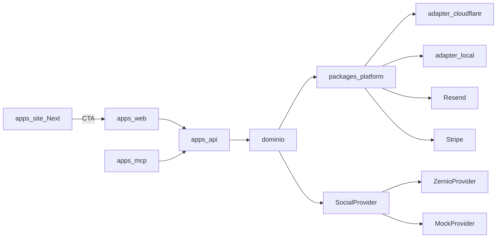

# Stack — Capyra

**Status:** revisado
**Data:** 20/09/2026
**Depende de:** [`CONTEXT.md`](../CONTEXT.md), [`PRD.md`](PRD.md), [ADRs](adr/README.md)

Este documento fecha a stack do repositório. Não redefine o domínio. Escolhas caras de reverter estão também em ADRs 0006–0010.

---

## 1. Princípio

TypeScript no **contrato web-standard** (`Request` / `Response`, Web Crypto, sem `fs` nem Express no domínio). A nuvem é um **adapter**. O primeiro adapter é **Cloudflare**.

Trocar de nuvem é reimplementar adapters (SQL, blob, fila, cron, e-mail, billing, secrets) — não reescrever API, Webapp nem as regras de negócio. O Site é Next.js isolado: portá-lo é portar o Next, não o Capyra.

Proibido no domínio e nas rotas da API:

- APIs só da Cloudflare (`env.D1`, Durable Objects, KV, Workers AI) fora da pasta do adapter
- IDs ou tipos do **Fornecedor social** na API pública (já em [ADR 0004](adr/0004-social-provider-is-an-internal-adapter.md))
- Nest.js, Express, Prisma, Firebase Auth, Next.js **no webapp ou na API**

Fora deste corte (estrutura e features futuras, sem pastas no repo agora):

- Python, análise de dados e IA
- CLI

---

## 2. Aplicações

Monorepo npm workspaces. Quatro apps.

| App | Papel | Runtime | Fala com |
| --- | --- | --- | --- |
| `apps/api` | Única fronteira de negócio | TypeScript + **Hono** | DB, blob, fila, Resend, Stripe, `SocialProvider` |
| `apps/web` | Webapp autenticado (Operadores) | TypeScript + **Vite + React + TanStack Router** | Só `/api/v1` |
| `apps/site` | Site público (marketing, SEO) | TypeScript + **Next.js**, app isolado | Conteúdo e CTA para o webapp; sem sessão de Operador |
| `apps/mcp` | MCP headless | TypeScript + **`@modelcontextprotocol/server`** + **`createMcpHandler`** | Só `/api/v1` |



---

## 3. Por que estes frameworks

### 3.1 API — Hono, não Nest.js

Hono é um roteador no modelo Fetch. Roda em Workers, Node, Bun e Deno com o mesmo código. É o adapter de HTTP, não o domínio.

**Nest.js recusado:** IoC, decorators e `express`/`fastify` assumem Node. No Worker vira emulação. Em container, abandona o motivo de começar na Cloudflare.

Contrato público: OpenAPI em `contracts/openapi/capyra-api.v1.yaml`. Tipos e validadores **gerados** (Zod ou equivalente). A API não inventa campos que o contrato não tem.

### 3.2 Webapp — Vite + React + TanStack Router, não Next.js

O webapp é autenticado. SEO de rota logada não importa. O app consome `/api/v1` no browser.

**Next.js recusado no webapp:** App Router acopla a um server Node/Vercel. Na Cloudflare depende de OpenNext — um adapter *do Next*, não da nossa plataforma. Portar o produto autenticado seria portar o Next.

TanStack Router + Query no Vite: rotas type-safe, cache via API Capyra, deploy estático + API separada.

UI: **Tailwind CSS + shadcn/ui** em `packages/ui`, consumido pelo webapp. O site não importa rotas, sessão nem data layer do webapp.

### 3.3 Site — Next.js isolado, separado do webapp

O site é um app Next.js próprio (`apps/site`): marketing, SEO, **Idioma** `pt-BR` / `en` / `es`. Não autentica **Operador**, não chama `/api/v1` de negócio, não fala com o **Fornecedor social**.

Isolamento:

- repositório compartilhado, **runtime e deploy separados**
- cookies e sessão do webapp não existem no site
- sem import de `apps/web` nem de `apps/api`
- tokens visuais podem ser copiados ou extraídos com cuidado; não há pacote obrigatório compartilhado com o webapp neste corte

O Site pode usar o adapter de hospedagem que o Next exigir (Node ou OpenNext na Cloudflare). Isso **não** afrouxa o princípio web-standard da API, do webapp e do MCP.

### 3.4 MCP headless — SDK v2 stateless, sem Durable Object

`apps/mcp` é um Worker TypeScript. Ferramentas (calendário, rascunho, métricas permitidas pelo **Papel**) chamam só `/api/v1` com credencial de **Operador**. Sem UI. Sem D1, R2, Stripe, Resend ou Zernio.

**SDK (custo baixo na Cloudflare):**

| Peça | Pacote | Papel |
| --- | --- | --- |
| Servidor MCP | `@modelcontextprotocol/server` (SDK **v2**) | `McpServer`, tools, protocol 2026-07-28 |
| Ponte Workers | `agents` → `createMcpHandler` em `agents/mcp/server` | `fetch` stateless por request |
| Schemas | `zod` | input das tools |

Por que esse e não outro:

- **Stateless:** um servidor novo por request, sem sessão MCP persistida. Cobra só Worker (request + CPU). Não abre Durable Object.
- **`McpAgent` recusado:** é o caminho legado, feature-frozen, e **cada sessão vira Durable Object** (SQL embutido, storage, round-trips). Isso é o oposto de baixo custo para um plugin headless que só faz proxy da API.
- **`@modelcontextprotocol/sdk` v1 + `createLegacyMcpHandler` recusado** para app novo: `WorkerTransport`, sessões, replay. Só faria sentido como ponte temporária.
- O SDK oficial Node stdio (`StdioServerTransport`) não roda em Workers.

Auth do MCP: token/OAuth de **Operador** validado **antes** de `createMcpHandler` (a handler não verifica o token sozinha). O factory recebe `authInfo` e as tools usam o mesmo `/api/v1` do webapp.

Descrições de tools seguem o **Idioma** do Operador (`pt-BR`, `en`, `es`).

### 3.5 Adiado — IA / Python

Não há `apps/ai`. Relatórios da v1 saem da API em TypeScript.

---

## 4. Dados e ORM

**Drizzle ORM** + SQL.

| Agora (Cloudflare) | Depois (outra nuvem) |
| --- | --- |
| D1 (SQLite) | Postgres |
| R2 | S3 (API compatível) |
| Queues + Cron | SQS/PubSub + scheduler |
| Secrets do Worker | Secrets Manager / env |

Drizzle fala SQLite e Postgres. Prisma recusado: pesado no Worker, schema engine à parte, D1 de segunda classe.

Binários (mídia, PDF de relatório) **nunca** no SQL. SQL guarda metadados e referências. Upload para o fornecedor social é servidor-a-servidor, bucket privado.

Migrações versionadas no repo, aplicadas pelo adapter (D1 no v1).

---

## 5. `packages/platform` — o que é portável

Um pacote, várias implementações. O domínio depende da interface, não do Cloudflare.

| Porta | Responsabilidade | v1 | Troca |
| --- | --- | --- | --- |
| `db` | SQL, transação, migrations | D1 | Postgres |
| `blob` | Objetos privados por Conta/Marca | R2 | S3 |
| `queue` | Jobs sociais, webhooks | Queues | SQS ou similar |
| `scheduler` | Agendamentos distantes, reconciliação | Cron | Cloud Scheduler |
| `email` | Link mágico, código, convite, aviso de fatura | **Resend** | o mesmo contrato |
| `billing` | Checkout, assinatura, webhook de pagamento | **Stripe** | o mesmo contrato |
| `secrets` | chaves, webhook HMAC | Worker secrets | o mesmo contrato |
| `auth` | sessão do Operador (cookie httpOnly) | tabelas no `db` | igual — auth é nosso |

Auth **não** é Firebase, Clerk nem Auth0. Link mágico e código de acesso vivem na API. O disparo sai pelo Resend, com remetente e templates Capyra (sem nome do **Fornecedor social**).

Cobrança: Stripe Checkout / Billing para o **Proprietário**, em BRL, alinhado à **Identidade social do ciclo**. A UI Capyra mostra faturas em linguagem Capyra; o Stripe é o trilho de pagamento (e pode aparecer na página de checkout, como o próprio Stripe exige).

---

## 6. Integrações de produto

| Integração | Onde | Porta |
| --- | --- | --- |
| Zernio | só `ZernioProvider` | `SocialProvider` |
| Redes sociais | OAuth da rede, via provider | nunca direto da UI |
| Resend | `packages/platform` | `email` |
| Stripe | API, webhooks de billing | `billing` |

O webapp e o MCP não conhecem Zernio, D1, R2, chave Resend nem chave secreta Stripe. O site não conhece nenhum dos quatro.

Webhooks: endpoint interno para o **Fornecedor social** e endpoint interno para o Stripe; ambos HMAC, deduplicação e vocabulário Capyra na borda pública.

---

## 7. Idiomas

Catálogos em `packages/i18n` (`pt-BR`, `en`, `es`). Padrão **`pt-BR`**.

| Superfície | Como escolhe o idioma |
| --- | --- |
| Site | prefixo `/pt-br`, `/en`, `/es` |
| Webapp | **Idioma** do Operador (seletor); fallback `pt-BR` |
| E-mail Resend | **Idioma** do destinatário |
| MCP | descrições de tools no **Idioma** do Operador autenticado |
| API | `code` em inglês; mensagem humana localizada |

**Fuso da marca** não é idioma. Texto de Destino não é traduzido.

---

## 8. Testes e qualidade

- TypeScript: Vitest (unidade/contrato), testes de isolamento por **Conta Capyra** / **Marca**
- E2E do webapp: Playwright contra API + `MockProvider`
- `MockProvider` obrigatório em local e CI; credencial real do fornecedor só no Gate white label
- Typecheck + contrato OpenAPI no CI

---

## 9. Estrutura de pastas (alvo)

```
apps/api          Hono, domínio, SocialProvider
apps/web          Vite, React, TanStack Router
apps/site         Next.js (isolado)
apps/mcp          MCP headless (SDK v2 + createMcpHandler)
packages/platform contratos de nuvem + adapter Cloudflare + adapter local
                  + email Resend + billing Stripe
packages/ui       shadcn/Tailwind (webapp)
packages/i18n     catálogos pt-BR, en, es
packages/contracts OpenAPI gerado
docs/             PRD, stack, adr
CONTEXT.md
```

Desenvolvimento local: Wrangler (API, MCP, D1, R2, Queues) + Vite (web) + Next (site). Sem container Python.

---

## 10. Recusados (para não reabrir sem ADR)

| Opção | Por que não |
| --- | --- |
| Nest.js | Node-first; Workers vira emulação |
| Next.js no webapp | Portabilidade do Next, não do Capyra; app autenticado não precisa de SEO de App Router |
| Site e webapp no mesmo Next | SEO e sessão no mesmo runtime; fura o isolamento pedido |
| Astro no site | Substituído: o site é Next.js isolado |
| Express / Fastify | Mesmo problema do Nest |
| Prisma | Worker/D1; engine à parte |
| Firebase Auth / Clerk | Segundo vendor na sessão do Operador |
| Durable Objects no domínio | Lock-in Cloudflare |
| `McpAgent` / MCP SDK v1 com sessão | Durable Object por sessão; caro e legado |
| Python neste corte | Adiado; não criar `apps/ai` agora |
| SES, e-mail no Worker, SMTP avulso | Resend é o porta `email` da v1 |
| Pagar.me / billing manual como trilho | Stripe é o checkout da plataforma |

---

## 11. Critério de aceite da stack

A stack está aceita quando:

1. `apps/api` sobe num Worker com Hono e o mesmo código também sobe num process Fetch sem APIs Cloudflare no domínio.
2. `apps/web` é um build Vite estático falando só com `/api/v1`.
3. `apps/site` é um Next.js que não importa `apps/web` nem `apps/api` e não carrega sessão de Operador.
4. `apps/mcp` usa `@modelcontextprotocol/server` + `createMcpHandler`, é stateless (sem Durable Object) e só chama `/api/v1`.
5. Não existe `apps/ai` neste repositório.
6. Site, webapp, e-mails e MCP cobrem `pt-BR`, `en` e `es` (`pt-BR` padrão).
7. E-mail transacional de auth/convite sai pelo Resend com marca Capyra.
8. Checkout e recorrência do **Proprietário** passam pelo Stripe; a fatura Capyra conta **Identidades sociais do ciclo**.
9. Trocar D1 por Postgres exige um novo adapter `db`, não um rewrite das rotas.

